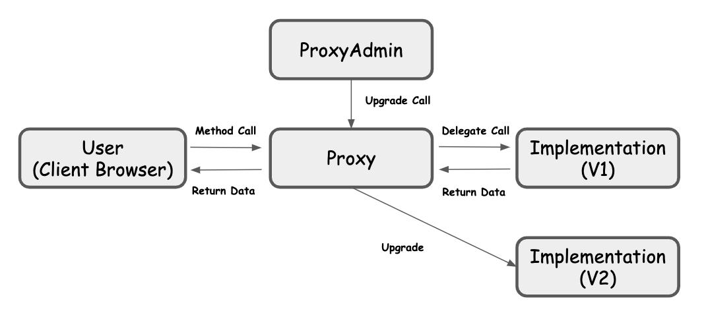

# Ethereum Contract Upgrade Manager
  

This is CLI to deploy your contract with upgradeable architecture.  

## Install
```$ npm install -g ethereum-contract-sexy-manager```
## Architecture

### Jargon
- Implementation  
The implementation is one or more contracts to be deployed. This repository has a [sample contract](https://github.com/NoCtrlZ/ethereum-contract-sexy-manager/blob/master/contracts/Sample1.sol).  
- Proxy  
This contract uses delegate call for implementation contract when it is called by user.  
- Proxy Admin  
This contract manages Proxy contract. This contract changes the implementation address stored on Proxy contract and the administrator.
### Flow
If you execute `$ sexydynamite create` this CLI works as following.  
1. Deploy the implementation you indecate with option.  
2. Deploy the Proxy Admin contract and store your address as the administrator.  
3. Deploy the Proxy and store the Proxy Admin address as manager.  

## Commands
```$ sexydynamite init```  
Create `.sexydynamite` directory and `.session` you can set your wallet and private key here, and add `.session` file to .gitignore in order not to push your private information.  

```$ sexydynamite create -c {Contract Name}```  
Deploy your contract with above architecture. The contract needs to be compiled `build/contracts` directory. The project information is emited on `sexydynamite/deployed.json`.

## Test
```$ truffle test```
